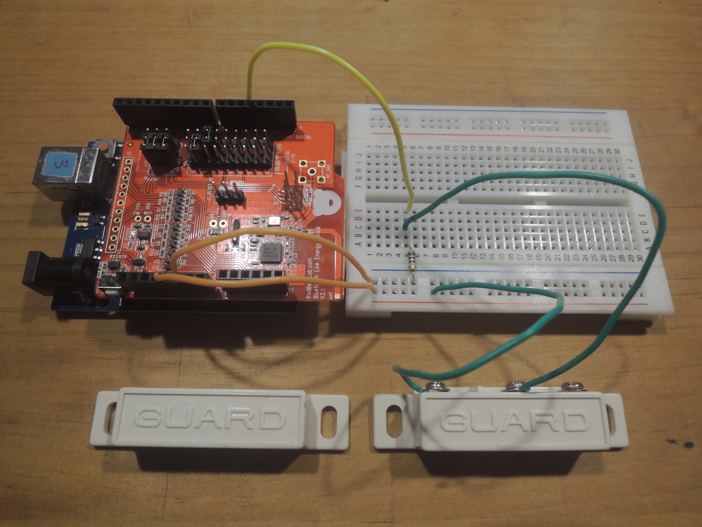
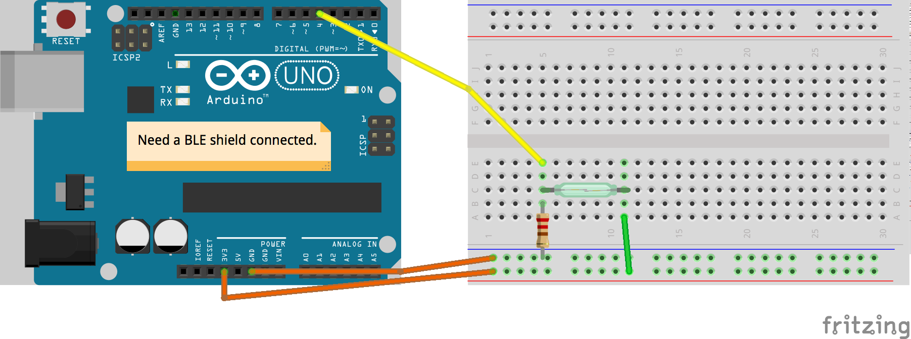

# BLE Reed Switch
An Arduino firmware to drive a Bluetooth Low Energy based reed switch to sense your house doors or desk drawers. It depends on the [Arduino BLEPeripheral][arduino-bleperipheral] library. The BLE shield used here is [RedBear BLE Shield V2.1][redbear-ble-shield].

## Layout
Please connect a BLE shield to your Arduino board.

[arduino-bleperipheral]: https://github.com/sandeepmistry/arduino-BLEPeripheral
[redbear-ble-shield]: http://redbearlab.com/bleshield
